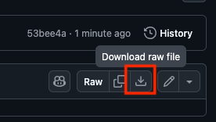
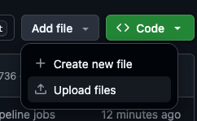
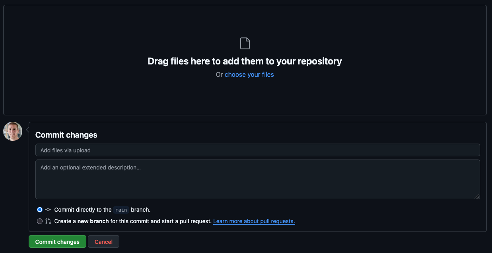
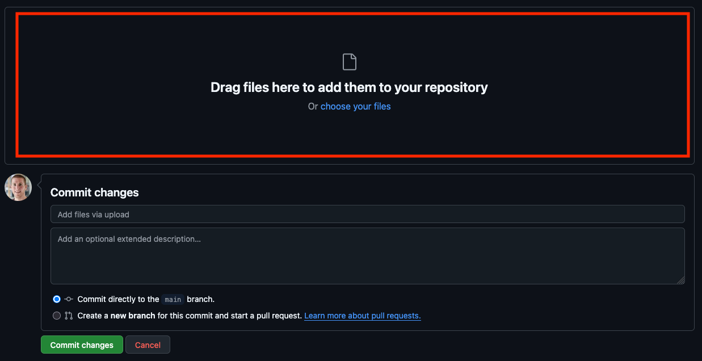
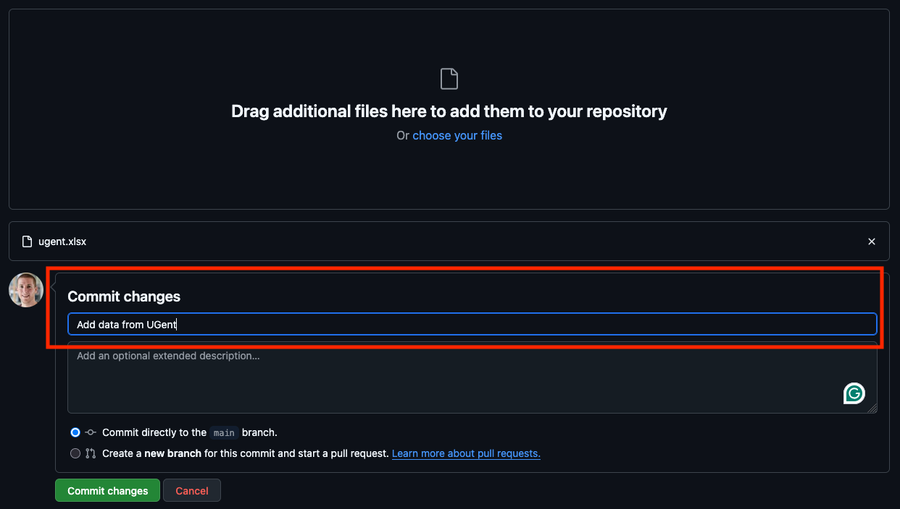
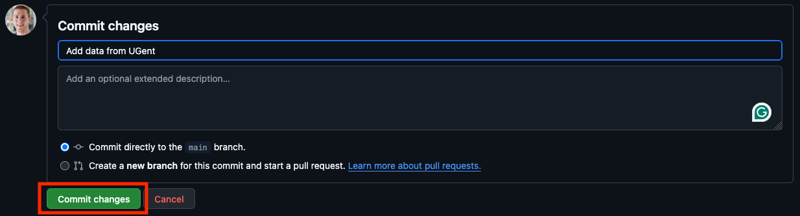
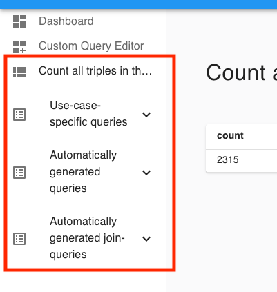

# Implementation process pipeline

This template repo helps with setting up a pipeline for an OSLO implementation process (implementatietraject).

- [Application profile]({{AP-URL}})
- [SHACL]({{SHACL-URL}})

## Table of contents

<!-- TOC -->
- [Implementation process pipeline](#implementation-process-pipeline)
  - [Table of contents](#table-of-contents)
  - [Usage](#usage)
    - [Setting up this repository](#setting-up-this-repository)
    - [Configure the dashboard](#configure-the-dashboard)
    - [Adding data via an Excel file](#adding-data-via-an-excel-file)
    - [Updating data in an Excel file](#updating-data-in-an-excel-file)
    - [Execute queries via the dashboard](#execute-queries-via-the-dashboard)
    - [How to work with branches](#how-to-work-with-branches)
    - [How to host the dashboard on your own server](#how-to-host-the-dashboard-on-your-own-server)
  - [Extras](#extras)
<!-- TOC -->

## Usage

### Setting up this repository

You only have to do these steps once.

1. [Create a new repository based on this repository](https://docs.github.com/en/repositories/creating-and-managing-repositories/creating-a-repository-from-a-template).
   Make sure check the option "Include all branches".
2. Remove all the data from the `gh-pages` branch.
3. Navigate to Settings > Actions > General > Workflow permissions and
   make sure that "Read and write permissions" is checked.
4. [Set up GitHub pages](https://docs.github.com/en/pages/getting-started-with-github-pages/creating-a-github-pages-site#creating-your-site)
   and let it point to the root directory on the `gh-pages` branch.
5. Set the link to the application profile at `env.ap_url` in the file `.github/workflows/pipeline.yml`.
6. Set the link to the SHACL at `env.shacl_url` in the file `.github/workflows/pipeline.yml`.
7. Read and, if necessary, update [the license](LICENSE).
8. Commit and push your changes to GitHub.
   This will trigger the workflows, which will also add example data to the [example-data](./example-data) directory.
9. Navigate to Actions and make sure that there are no errors in the workflows.
10. Copy the Excel files in the `example-data` directory to the [data](./data) directory.
11. Once the workflows have finished, the dashboard is available via your GitHub pages.
12. If everything works, empty the [data](./data) directory.
    You can now start [adding data](#adding-data-via-an-excel-file).
13. [Configure the dashboard](#configure-the-dashboard).

### Configure the dashboard

You can configure the dashboard via the following steps:

1. [Check](#how-to-work-with-branches) if you are using the correct branch or need to make a new one.
2. Create a copy of [this directory](https://github.com/RMLio/ap-data-to-dashboard/blob/main/miravi-initial-config/)
   in the root of the repo and rename it to `dashboard-config`.
3. Update the content of `dashboard-config`.
   You find the options of the dasboard in `dashboard-config/config.json`.
   See [this section](https://github.com/SolidLabResearch/miravi-a-linked-data-viewer?tab=readme-ov-file#configuration-file)
   for more information about the different options.
   You don't need to add the option `comunicaContext`,
   because the pipeline sets this automatically.
   You store queries in `dashboard-config/public/queries`.

### Adding data via an Excel file

Note that adding data to this repository makes the data public
and the data will have [this license](LICENSE).

1. [Check](#how-to-work-with-branches) if you are using the correct branch or need to make a new one.
2. Download the Excel template called `template.xlsx` or an Excel file with example data:
    - Excel template:
        1. Browse to [the template in the repository](template.xlsx).
        2. Download the template by clicking on download icon (with the tooltip "Download raw file") on the right:

           
    - Excel file with example data:
        1. Navigate to the [example-data](./example-data) directory.
        2. Click on one of the Excel files.
        3. Download the Excel file by clicking on download icon (with the tooltip "Download raw file") on the right:

      
3. Rename the Excel file to something meaningful like the name of your organisation,
   for example, `ugent.xlsx` for Ghent University.
4. Fill in your data in the Excel file.
5. Upload the Excel to the repository.
    1. Navigate to the [data](./data) directory.
    2. Click on "Add file":

       
    3. Click on "Upload files":

       
    4. You get a page where you can upload the Excel file:

       
    5. Upload the Excel file at the top

       
    6. Add a message describing your changes under the header "Commit changes":

       

       This can be, for example, "Add data from UGent".
    7. Click on the button "Commit changes":

       

### Updating data in an Excel file

Note that adding data to this repository makes the data public
and the data will have [this license](LICENSE).

1. [Check](#how-to-work-with-branches) if you are using the correct branch or need to make a new one.
2. Download the Excel file that you want to update:
    1. Browse to Excel file that you want to update.
    2. Download the template by clicking on download icon (with the tooltip "Download raw file") on the right:

       
3. Update the data in the Excel file.
4. Upload the Excel to the repository via the instructions in
   [step 4 of the section on how to add data via an Excel file](#adding-data-via-an-excel-file).

### Execute queries via the dashboard

1. Browse to the GitHub pages of this repository.
2. Click on one of the queries on the left:

   

### How to work with branches

The `main` branch contains the stable version of the data and dashboard configuration.
Users need to use other branches and merge requests to update the data or dashboard configuration.

The pipeline uses the `gh-pages` branch to host the different versions of the dashboard.
It keeps one version per branch.
It will host the dashboard that is built from the `main` branch at the root of the GitHub pages.
It will host the dashboards of other branches at `/[branch-name]` of the GitHub pages.
Forbidden branch names are `assets`, `images`, and `queries`.

### How to host the dashboard on your own server

You can host the dashboard on your own server
by copying the static files from the `gh-pages` branch to your own server:

1. Navigate to the `gh-pages` branch.
2. Do you want to the host the dashboard built from the `main` branch or another branch?
   - If from the `main` branch, download the file `index.html` and the directories `assets`, `images`, and `queries`.
   - If from another branch, download the directory with the same name as the branch.
3. Copy the files and directories to your server and
   follow the server-specific instructions on how to host them.

Note that the dashboard will still rely on the RDF in this repository.

## Extras

- You can reset the README.md via

  ```shell
  ./scripts/reset-readme.sh
  ```

- Delete `in-shacl/shacl.ttl` to download the SHACL again.
- Delete `template.xlsx` to regenerate the template Excel file and example data.
- You can reset the whole repo via

  ```shell
  ./scripts/reset-repo.sh
  ```

- Some example env values are

   ```yaml
   env:
     ap_url: https://data.vlaanderen.be/doc/applicatieprofiel/leermiddelen/ontwerpstandaard/2025-03-21/
     shacl_url: https://data.vlaanderen.be/doc/applicatieprofiel/leermiddelen/kandidaatstandaard/2025-08-01/shacl/leermiddelen-SHACL.ttl
   ```
